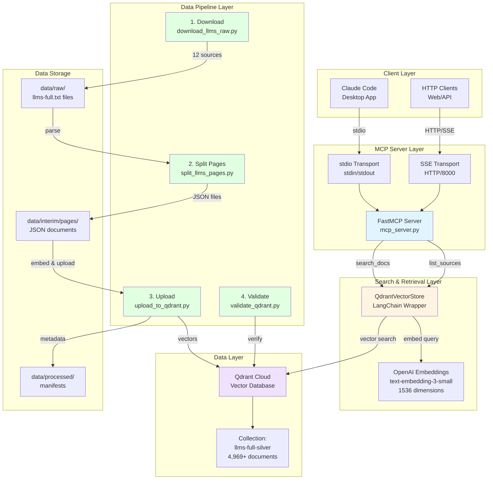
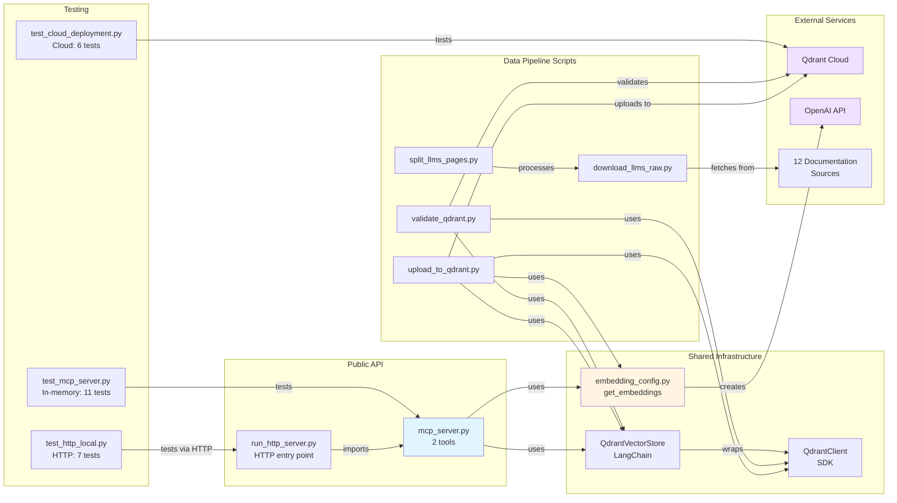
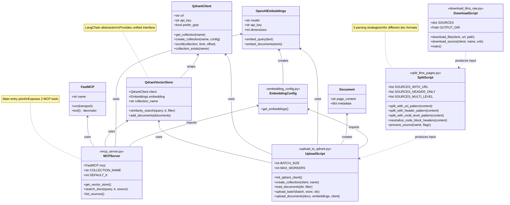
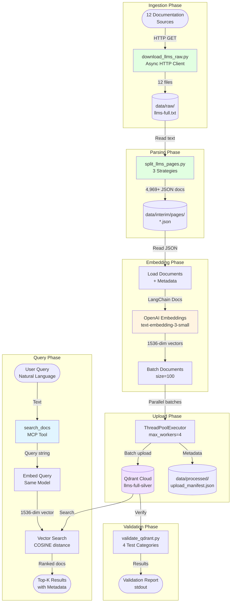
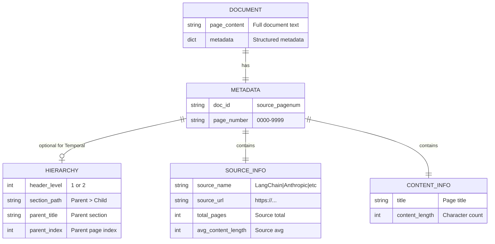
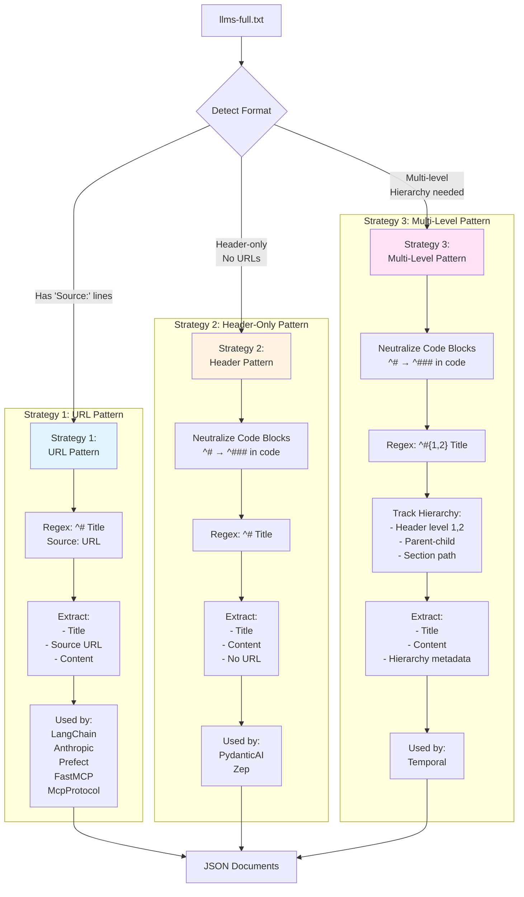

# Architecture Diagrams

**Project**: graphiti-qdrant
**Description**: Semantic documentation search via Qdrant vector store and FastMCP server
**Generated**: 2025-12-18

---

## System Architecture



### Explanation

This diagram shows the complete system architecture across five key layers:

**1. Client Layer**: Two client types access the MCP server
- **Claude Code**: Desktop integration using stdio transport (stdin/stdout)
- **HTTP Clients**: Web/API clients using Server-Sent Events (SSE) transport

**2. MCP Server Layer**: FastMCP 2.0 server with dual transport support
- Single codebase (`mcp_server.py`) supports both stdio and SSE transports
- Exposes 2 tools: `search_docs()` and `list_sources()`
- Entry points: `mcp_server.py` (stdio) and `run_http_server.py` (HTTP/SSE)

**3. Search & Retrieval Layer**: Vector search infrastructure
- **QdrantVectorStore**: LangChain wrapper providing unified interface
- **OpenAI Embeddings**: text-embedding-3-small model (1536 dimensions)
- Embedding consistency: same model used for upload and search

**4. Data Layer**: Cloud-hosted vector database
- **Qdrant Cloud**: Managed vector database service with gRPC support
- **Collection**: llms-full-silver with 4,969+ documentation pages
- Configuration: COSINE distance, on-disk storage for cost optimization

**5. Data Pipeline Layer**: ETL process for documentation ingestion
- **Download** (download_llms_raw.py): Fetches llms-full.txt from 12 sources
- **Split** (split_llms_pages.py): Parses into individual page documents using 3 strategies
- **Upload** (upload_to_qdrant.py): Generates embeddings and uploads to Qdrant
- **Validate** (validate_qdrant.py): Comprehensive testing and validation

**Key Design Decisions**:
- **Transport Agnostic**: Single server supports both local (stdio) and cloud (HTTP/SSE) deployment
- **Embedding Consistency**: Same OpenAI model (text-embedding-3-small) used throughout
- **Cost Optimization**: on_disk storage in Qdrant saves RAM costs
- **Parallel Processing**: Concurrent downloads, batch uploads with ThreadPoolExecutor

---

## Component Relationships



### Explanation

This diagram illustrates the component relationships and dependencies within the system:

**Public API Components**:
- `mcp_server.py`: Core server exposing search_docs() and list_sources() tools
- `run_http_server.py`: Thin wrapper for HTTP/SSE transport mode

**Shared Infrastructure** (used by multiple components):
- `embedding_config.py`: Factory function for OpenAI embeddings (DRY principle)
- `QdrantVectorStore`: LangChain abstraction over Qdrant client
- `QdrantClient`: Official Qdrant SDK for low-level operations

**Data Pipeline** (linear dependency chain):
1. Download raw documentation from 12 sources
2. Split into individual page JSON files (3 parsing strategies)
3. Upload to Qdrant with embeddings (parallel batch processing)
4. Validate collection integrity and search quality

**Testing Strategy** (FastMCP 3-phase approach):
- **Phase 1 (80%)**: In-memory tests using FastMCP client (11 tests, fast & deterministic)
- **Phase 2 (15%)**: Local HTTP tests validating network behavior (7 tests)
- **Phase 3 (5%)**: Cloud deployment validation (6 tests, production verification)

**Key Patterns**:
- **Factory Pattern**: `get_embeddings()` and `get_vector_store()` for dependency injection
- **Wrapper Pattern**: LangChain's QdrantVectorStore provides clean abstraction
- **Strategy Pattern**: Multiple document splitting strategies (URL, header-only, multi-level)
- **Pipeline Pattern**: Sequential ETL stages with clear boundaries

---

## Class Hierarchies



### Explanation

This class diagram shows the key classes and their relationships:

**External Framework Classes** (from libraries):
- **FastMCP**: MCP server framework with transport abstraction
- **QdrantVectorStore**: LangChain wrapper for Qdrant operations
- **QdrantClient**: Official Qdrant Python SDK
- **OpenAIEmbeddings**: LangChain wrapper for OpenAI embedding API
- **Document**: LangChain document abstraction with content + metadata

**Application Modules** (project-specific):
- **MCPServer** (mcp_server.py): Main server with 2 decorated tool functions
- **UploadScript** (upload_to_qdrant.py): ETL script with batch upload logic
- **SplitScript** (split_llms_pages.py): Document parser with 3 strategies
- **DownloadScript** (download_llms_raw.py): Async HTTP downloader
- **EmbeddingConfig** (embedding_config.py): Shared configuration factory

**Key Relationships**:
- **Uses**: Direct dependency (imports and instantiates)
- **Wraps**: Abstraction pattern (QdrantVectorStore wraps QdrantClient)
- **Creates**: Factory pattern (EmbeddingConfig creates OpenAIEmbeddings)
- **Produces Input**: Pipeline dependency (output of one is input to next)

**Design Highlights**:
1. **Single Responsibility**: Each script has one clear purpose
2. **Dependency Injection**: get_embeddings() and get_vector_store() factories
3. **Framework Integration**: Leverages LangChain abstractions for consistency
4. **Shared Configuration**: EmbeddingConfig ensures embedding consistency

**Notable Methods**:
- `search_docs()`: Core search functionality with metadata filtering
- `list_sources()`: Scroll API to count documents by source
- `upload_documents()`: Parallel batch upload with ThreadPoolExecutor
- `split_with_*_pattern()`: Strategy pattern for different doc formats

---

## Module Dependencies

```mermaid
graph TD
    subgraph "Entry Points"
        MCPMAIN[mcp_server.py]
        HTTPMAIN[run_http_server.py]
    end

    subgraph "Core Libraries"
        FASTMCP[fastmcp]
        LANGCHAIN[langchain_*]
        QDRANT[qdrant_client]
        OPENAI[langchain_openai]
        DOTENV[python-dotenv]
    end

    subgraph "Pipeline Scripts"
        DOWNLOAD[download_llms_raw.py]
        SPLIT[split_llms_pages.py]
        UPLOAD[upload_to_qdrant.py]
        VALIDATE[validate_qdrant.py]
    end

    subgraph "Shared Config"
        EMBCFG[embedding_config.py]
    end

    subgraph "External APIs"
        QDRANTAPI[Qdrant Cloud API]
        OPENAIAPI[OpenAI API]
        DOCSITES[Documentation Sites]
    end

    subgraph "Data Files"
        ENV[.env]
        RAW[data/raw/*.txt]
        JSON[data/interim/*.json]
        MANIFEST[data/processed/*.json]
    end

    MCPMAIN --> FASTMCP
    MCPMAIN --> LANGCHAIN
    MCPMAIN --> QDRANT
    MCPMAIN --> OPENAI
    MCPMAIN --> DOTENV
    MCPMAIN --> ENV

    HTTPMAIN --> MCPMAIN

    UPLOAD --> EMBCFG
    UPLOAD --> LANGCHAIN
    UPLOAD --> QDRANT
    UPLOAD --> DOTENV
    UPLOAD --> ENV
    UPLOAD --> JSON
    UPLOAD --> MANIFEST

    VALIDATE --> EMBCFG
    VALIDATE --> LANGCHAIN
    VALIDATE --> QDRANT
    VALIDATE --> DOTENV
    VALIDATE --> ENV

    EMBCFG --> OPENAI
    EMBCFG --> DOTENV
    EMBCFG --> ENV

    DOWNLOAD --> DOCSITES
    DOWNLOAD --> RAW

    SPLIT --> RAW
    SPLIT --> JSON

    UPLOAD --> QDRANTAPI
    VALIDATE --> QDRANTAPI
    MCPMAIN --> QDRANTAPI

    EMBCFG --> OPENAIAPI

    style MCPMAIN fill:#e1f5ff
    style HTTPMAIN fill:#e1f5ff
    style FASTMCP fill:#fff4e1
    style LANGCHAIN fill:#fff4e1
    style QDRANTAPI fill:#f0e1ff
    style OPENAIAPI fill:#f0e1ff
```



### Explanation

This dependency graph shows module-level relationships and external dependencies:

**Entry Point Dependencies**:
- `mcp_server.py`: Depends on FastMCP, LangChain, Qdrant SDK, OpenAI, and environment config
- `run_http_server.py`: Thin wrapper that imports and runs mcp_server with SSE transport

**Core Library Stack**:
- **fastmcp** (0.7.0+): MCP server framework with dual transport support
- **langchain_*** (1.1.0+): Suite of LangChain packages for RAG operations
  - langchain-core: Document abstraction
  - langchain-qdrant: Qdrant vector store integration
  - langchain-openai: OpenAI embeddings
- **qdrant_client**: Official Qdrant Python SDK for low-level operations
- **python-dotenv**: Environment variable management

**Pipeline Dependencies**:
- **Download**: httpx (async HTTP) → raw text files
- **Split**: regex parsing → JSON documents with metadata
- **Upload**: LangChain + Qdrant SDK → vector database
- **Validate**: Query testing and verification

**Shared Configuration Module**:
- `embedding_config.py`: Centralized factory for OpenAI embeddings
- Used by: upload_to_qdrant.py, validate_qdrant.py, mcp_server.py
- Ensures consistent embedding model across all operations

**External API Dependencies**:
1. **Qdrant Cloud API**: Vector database operations (create, upload, search)
2. **OpenAI API**: Embedding generation (text-embedding-3-small)
3. **Documentation Sites**: 12 sources providing llms.txt/llms-full.txt files

**Configuration Files**:
- `.env`: Environment variables (API keys, URLs) - loaded by python-dotenv
- Required variables: QDRANT_API_URL, QDRANT_API_KEY, OPENAI_API_KEY

**Data Flow**:
1. Documentation sites → download_llms_raw.py → data/raw/*.txt
2. data/raw/*.txt → split_llms_pages.py → data/interim/pages/*.json
3. data/interim/pages/*.json → upload_to_qdrant.py → Qdrant Cloud
4. upload_to_qdrant.py → data/processed/upload_manifest.json

**Key Design Decisions**:
- **Embedding Consistency**: Single `get_embeddings()` factory ensures same model everywhere
- **Environment-Based Config**: No hardcoded credentials, all via .env
- **LangChain Abstraction**: Provides unified interface across different vector stores
- **Minimal Dependencies**: Core server only needs FastMCP, LangChain, Qdrant, OpenAI

---

## Data Flow Diagram



### Explanation

This comprehensive data flow diagram traces data through the entire system lifecycle:

**Phase 1: Ingestion** (download_llms_raw.py)
- Input: 12 documentation source URLs
- Process: Async HTTP download using httpx
- Output: 12 × 2 text files (llms.txt + llms-full.txt) in data/raw/
- Features: Concurrent downloads, error handling, manifest generation

**Phase 2: Parsing** (split_llms_pages.py)
- Input: llms-full.txt files (raw markdown)
- Process: Apply 3 different parsing strategies based on source format:
  1. **URL Pattern**: `# Title\nSource: URL` (LangChain, Anthropic, Prefect, FastMCP, McpProtocol)
  2. **Header-Only**: `# Title` with code block filtering (PydanticAI, Zep)
  3. **Multi-Level**: `# + ##` with hierarchy tracking (Temporal)
- Output: 4,969+ individual JSON files with title, content, metadata
- Features: Safe filename generation, content length tracking, per-source manifests

**Phase 3: Embedding** (upload_to_qdrant.py)
- Input: JSON documents + manifest metadata
- Process:
  1. Load JSON files into LangChain Document objects
  2. Merge with manifest metadata (total_pages, avg_content_length)
  3. Generate embeddings using OpenAI text-embedding-3-small
  4. Create 1536-dimensional vectors for each document
- Features: Rich metadata extraction, hierarchy support (header_level, section_path)

**Phase 4: Upload** (upload_to_qdrant.py)
- Input: Documents with embeddings
- Process:
  1. Batch documents (default: 100 per batch)
  2. Parallel upload using ThreadPoolExecutor (4 workers)
  3. Progress tracking with tqdm
- Output: Vectors stored in Qdrant Cloud collection
- Features: Configurable batch size, parallel processing, error recovery

**Phase 5: Validation** (validate_qdrant.py)
- Input: Populated Qdrant collection
- Process: 4 validation categories
  1. Collection config (dimension, distance, status)
  2. Document counts by source
  3. Metadata structure completeness
  4. Semantic search quality with test queries
- Output: Pass/fail report with detailed diagnostics
- Features: Expected count validation, search relevance testing

**Phase 6: Query** (mcp_server.py - search_docs)
- Input: Natural language user query
- Process:
  1. Embed query using same OpenAI model (consistency crucial)
  2. Vector similarity search in Qdrant (COSINE distance)
  3. Optional metadata filtering by source
  4. Rank results by similarity score
  5. Format with metadata (title, URL, hierarchy)
- Output: Top-K results with content previews (1000 chars)
- Features: K-parameter validation (1-20), fallback filtering, error handling

**Key Data Transformations**:
1. Raw text → Structured JSON (parsing)
2. JSON → LangChain Documents (loading)
3. Documents → 1536-dim vectors (embedding)
4. Vectors → Qdrant points (storage)
5. Query text → Vector → Ranked results (search)

**Critical Consistency Requirement**:
- Same embedding model (text-embedding-3-small, 1536 dims) used for both:
  - Upload phase (document vectorization)
  - Query phase (query vectorization)
- Mismatch would cause incorrect search results

---

## Testing Architecture

```mermaid
graph TB
    subgraph "Test Pyramid - FastMCP Strategy"
        P1[Phase 1: In-Memory<br/>80% Coverage<br/>11 Tests]
        P2[Phase 2: Local HTTP<br/>15% Coverage<br/>7 Tests]
        P3[Phase 3: Cloud<br/>5% Coverage<br/>6 Tests]

        P1 --> P2
        P2 --> P3
    end

    subgraph "Phase 1: test_mcp_server.py"
        IM[FastMCP In-Memory Client]
        T1[Server Ping]
        T2[List Tools]
        T3[List Sources]
        T4[Basic Search]
        T5[Source Filter]
        T6[K Validation]
        T7[Empty Results]
        T8[Cross-Source]
        T9[Error Handling]
        T10[Format Consistency]
        T11[Performance<br/>< 10s target]

        IM --> T1
        IM --> T2
        IM --> T3
        IM --> T4
        IM --> T5
        IM --> T6
        IM --> T7
        IM --> T8
        IM --> T9
        IM --> T10
        IM --> T11
    end

    subgraph "Phase 2: test_http_local.py"
        HTTP[HTTP Client<br/>localhost:8000/sse]
        H1[HTTP Connectivity]
        H2[List Tools via HTTP]
        H3[List Sources via HTTP]
        H4[Basic Search]
        H5[Filtered Search]
        H6[Performance<br/>~2.4s avg]
        H7[HTTP Error Handling]

        HTTP --> H1
        HTTP --> H2
        HTTP --> H3
        HTTP --> H4
        HTTP --> H5
        HTTP --> H6
        HTTP --> H7
    end

    subgraph "Phase 3: test_cloud_deployment.py"
        CLOUD[Cloud Client<br/>fastmcp.app]
        C1[Cloud Connectivity]
        C2[Cloud Tools]
        C3[Cloud Sources]
        C4[Cloud Search]
        C5[Cloud Performance<br/>< 2s target]
        C6[Cloud Error Handling]

        CLOUD --> C1
        CLOUD --> C2
        CLOUD --> C3
        CLOUD --> C4
        CLOUD --> C5
        CLOUD --> C6
    end

    subgraph "External Services"
        QDRANT[(Qdrant Cloud)]
        OPENAI[OpenAI API]
    end

    T3 -.->|API calls| QDRANT
    T4 -.->|API calls| QDRANT
    T4 -.->|Embeddings| OPENAI

    H3 -.->|API calls| QDRANT
    H4 -.->|API calls| QDRANT
    H4 -.->|Embeddings| OPENAI

    C3 -.->|API calls| QDRANT
    C4 -.->|API calls| QDRANT
    C4 -.->|Embeddings| OPENAI

    style P1 fill:#e1ffe1
    style P2 fill:#fff4e1
    style P3 fill:#ffe1e1
    style QDRANT fill:#f0e1ff
    style OPENAI fill:#f0e1ff
```



### Explanation

This diagram illustrates the comprehensive testing strategy following the FastMCP Cloud Promotion approach:

**Test Pyramid Philosophy**:
- **80% In-Memory**: Fast, deterministic, no network latency
- **15% Local HTTP**: Validate transport layer and network behavior
- **5% Cloud**: Final production environment verification

**Phase 1: In-Memory Testing** (test_mcp_server.py)
- **Framework**: pytest with pytest-asyncio
- **Client**: FastMCP in-memory client (zero-latency)
- **Coverage**: 11 comprehensive tests
- **Tests**:
  1. Server ping - basic connectivity
  2. List tools - verify 2 tools registered (search_docs, list_sources)
  3. List sources - validate all 8 sources present with doc counts
  4. Basic search - core semantic search functionality
  5. Source filter - metadata filtering capability
  6. K validation - parameter clamping (1-20 range)
  7. Empty results - graceful handling of no matches
  8. Cross-source - multi-source search validation
  9. Error handling - edge cases (empty query, invalid source)
  10. Format consistency - output format validation
  11. Performance - baseline < 10s (includes Qdrant API calls)

**Phase 2: Local HTTP Testing** (test_http_local.py)
- **Transport**: HTTP/SSE on localhost:8000
- **Prerequisite**: Server running via `run_http_server.py`
- **Coverage**: 7 tests validating network behavior
- **Tests**:
  1. HTTP connectivity - basic ping over HTTP
  2. List tools via HTTP - transport layer validation
  3. List sources via HTTP - verify 4+ sources (reduced validation)
  4. Basic search - search functionality over HTTP
  5. Filtered search - metadata filtering over HTTP
  6. Performance - target ~2.4s avg (faster than in-memory due to no local API calls)
  7. HTTP error handling - network error scenarios

**Phase 3: Cloud Deployment Testing** (test_cloud_deployment.py)
- **Environment**: Production cloud deployment (https://qdrant-docs.fastmcp.app/mcp)
- **Coverage**: 6 tests verifying production readiness
- **Tests**:
  1. Cloud connectivity - verify deployment accessible
  2. Cloud tools - validate tool registration in production
  3. Cloud sources - verify data availability
  4. Cloud search - end-to-end search functionality
  5. Cloud performance - target < 2s (production SLA)
  6. Cloud error handling - production error scenarios

**External Dependencies**:
- **Qdrant Cloud**: All phases make real API calls for realistic testing
- **OpenAI API**: Embedding generation for search queries

**Testing Strategy Rationale**:
1. **Fast Feedback Loop**: In-memory tests run in seconds
2. **Progressive Validation**: Each phase validates a new layer
3. **Realistic Testing**: No mocking of Qdrant/OpenAI - real API calls
4. **Performance Benchmarking**: Each phase has specific performance targets
5. **Production Confidence**: Cloud tests verify actual deployment

**Key Metrics**:
- **Total Tests**: 24 (11 + 7 + 6)
- **Coverage Distribution**: 80/15/5 split per FastMCP strategy
- **Performance Targets**:
  - In-memory: < 10s (includes remote API latency)
  - Local HTTP: ~2.4s avg
  - Cloud: < 2s (production SLA)

---

## Metadata Schema



### Explanation

This entity-relationship diagram shows the metadata schema for documents stored in Qdrant:

**Document Structure**:
- **page_content**: Full text content of the documentation page (not chunked)
- **metadata**: Dictionary with structured metadata fields

**Core Metadata Fields** (all documents):
- **doc_id**: Unique identifier format `{source_name}_{page_number}` (e.g., "LangChain_0042")
- **page_number**: Zero-padded 4-digit index (e.g., "0042")

**Source Information** (from manifest.json):
- **source_name**: Documentation source (e.g., "LangChain", "Anthropic", "Temporal")
- **source_url**: Original documentation page URL (null for header-only sources)
- **total_pages**: Total number of pages in this source
- **avg_content_length**: Average page size across the source

**Content Information** (from JSON files):
- **title**: Page title extracted from markdown header
- **content_length**: Character count of page_content

**Hierarchy Metadata** (optional - currently Temporal only):
- **header_level**: Markdown header level (1 for `#`, 2 for `##`)
- **section_path**: Breadcrumb path showing hierarchy (e.g., "Getting Started > Installation")
- **parent_title**: Title of parent section (null for top-level)
- **parent_index**: Index of parent page in source (null for top-level)

**Metadata Usage**:
1. **Filtering**: source_name used for filtered searches
2. **Display**: title, source_url shown in search results
3. **Context**: Hierarchy fields provide navigational context
4. **Analytics**: content_length, total_pages for statistics

**Design Decisions**:
- **No Chunking**: Full page content preserved for better context
- **Rich Metadata**: Extensive metadata enables sophisticated filtering and display
- **Optional Fields**: Hierarchy metadata only present for multi-level sources
- **URL Flexibility**: source_url can be null for sources without per-page URLs
- **Scalable IDs**: doc_id format supports unlimited pages per source

---

## Document Parsing Strategies



### Explanation

This diagram illustrates the three document parsing strategies used by split_llms_pages.py:

**Strategy Selection**:
- Based on documentation format and source requirements
- Configured via source lists: SOURCES_WITH_URL, SOURCES_HEADER_ONLY, SOURCES_MULTI_LEVEL

**Strategy 1: URL Pattern** (5 sources)
- **Pattern**: `^# Title\nSource: URL` - Title followed by Source line
- **Regex**: `^# (.+)$\nSource: (https?://[^\n]+)`
- **Sources**: LangChain, Anthropic, Prefect, FastMCP, McpProtocol
- **Use Case**: Documentation with per-page URLs
- **Extracted Fields**:
  - title: From markdown header
  - source_url: From Source: line
  - content: Everything between headers
  - content_length: Character count
- **No special processing needed**

**Strategy 2: Header-Only Pattern** (2 sources)
- **Pattern**: `^# Title` - Header only, no URL line
- **Regex**: `^# (.+)$`
- **Sources**: PydanticAI, Zep
- **Use Case**: Documentation without per-page URLs
- **Challenge**: Python code blocks contain `# comments` that look like headers
- **Solution**: Code block neutralization
  1. Find all code blocks: ` ```...``` `
  2. Replace `^#` with `^###` inside blocks
  3. Now `^#` only matches real headers
- **Extracted Fields**:
  - title: From markdown header
  - source_url: null
  - content: Everything between headers
  - content_length: Character count

**Strategy 3: Multi-Level Pattern** (1 source)
- **Pattern**: `^# Title` OR `^## Title` - Multiple header levels
- **Regex**: `^(#{1,2})\s+(.+)$`
- **Sources**: Temporal (complex hierarchical docs)
- **Use Case**: Documentation with nested sections requiring context
- **Features**:
  1. Code block neutralization (same as Strategy 2)
  2. Split on both `#` and `##` headers
  3. Track parent-child relationships
  4. Build breadcrumb paths
- **Extracted Fields**:
  - title: From markdown header
  - source_url: null
  - content: Everything between headers
  - content_length: Character count
  - **header_level**: 1 or 2 (number of # symbols)
  - **section_path**: "Parent > Child" breadcrumb
  - **parent_title**: Title of parent section (null for level 1)
  - **parent_index**: Index of parent page (null for level 1)

**Code Block Neutralization Algorithm**:
```
1. Find all ```...``` blocks using regex
2. Within each block:
   - Replace lines starting with "# " with "### "
   - Preserves code content but prevents header matching
3. Extract headers from neutralized content
4. Use same positions to extract from neutralized content
```

**Strategy Pattern Benefits**:
- **Flexibility**: Different sources, different formats
- **Extensibility**: Easy to add new strategies
- **Clean Code**: Each strategy is self-contained function
- **Reliability**: Handles edge cases per format

**Output Consistency**:
- All strategies produce JSON files with same structure
- Optional fields (source_url, hierarchy) are null if not applicable
- Enables uniform loading in upload_to_qdrant.py

---

**Document Version**: 1.0
**Last Updated**: 2025-12-18
**Generated By**: Claude Opus 4.5
