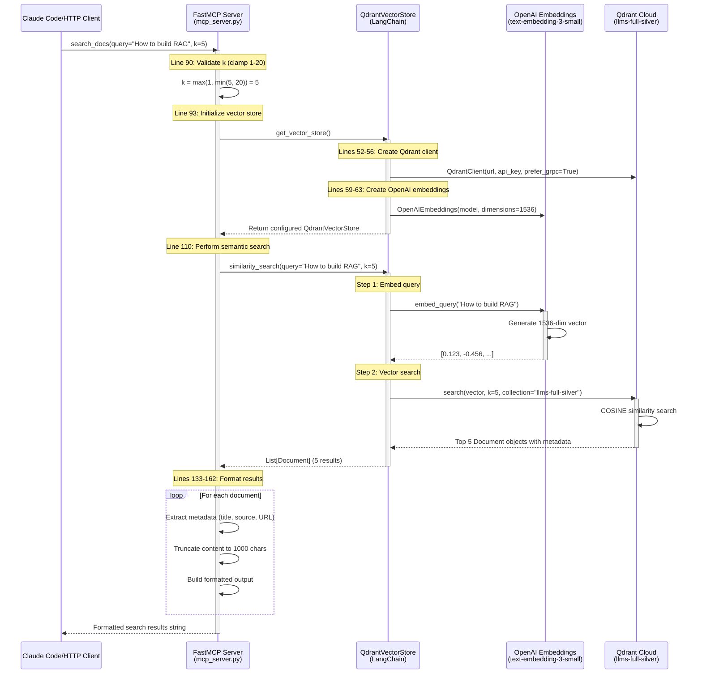
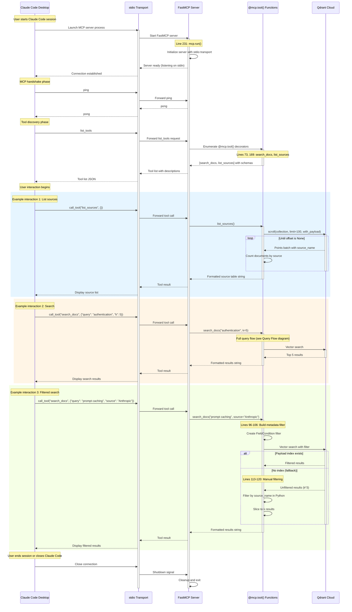
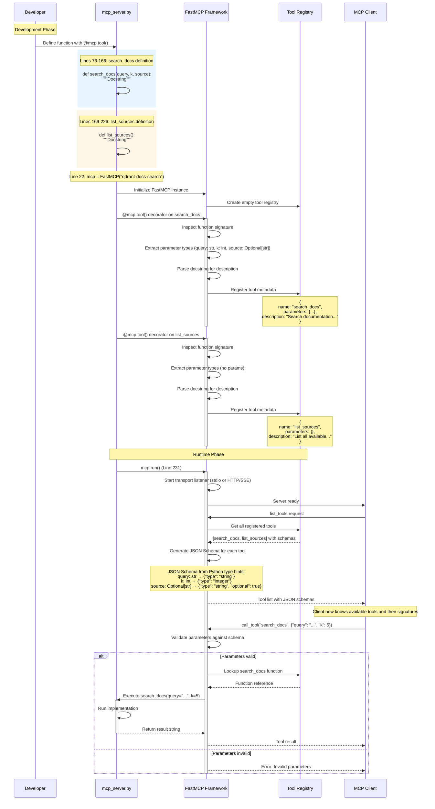
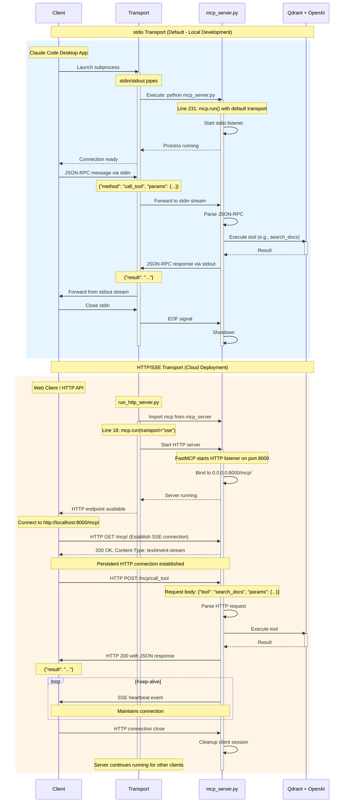
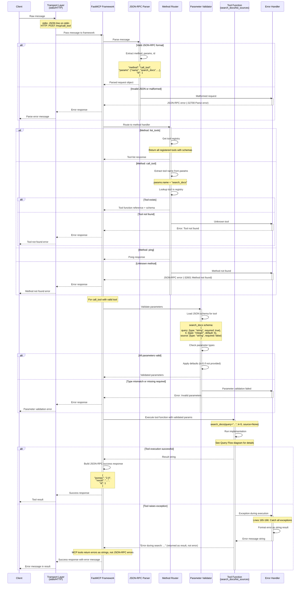

# Data Flow Analysis

**Project**: graphiti-qdrant
**Description**: Semantic documentation search via Qdrant vector store and FastMCP server
**Generated**: 2025-12-18

---

## Overview

This document provides detailed sequence diagrams and explanations for all major data flows in the graphiti-qdrant MCP server. The system supports two distinct operational phases:

1. **Data Pipeline Phase**: Ingestion and processing of documentation (offline)
2. **Query/Serving Phase**: Real-time search via MCP server (online)

---

## Query Flow

### Simple Query Flow Diagram



### Query Flow Explanation

**Entry Point**: `mcp_server.py:73-166`

The search query flow follows these stages:

**1. Request Reception (Lines 73-90)**
- Client invokes `search_docs()` tool via MCP protocol
- Parameters: query (string), k (int, default 5), source (optional string)
- K parameter validation: clamped between 1 and 20 (Line 90)
- Example: `search_docs("How to build RAG agent", k=5)`

**2. Vector Store Initialization (Lines 29-70)**
- `get_vector_store()` factory function creates configured instance
- Reads environment variables: `QDRANT_API_URL`, `QDRANT_API_KEY`, `OPENAI_API_KEY` (Lines 39-41)
- Creates Qdrant client with gRPC enabled for performance (Lines 52-56)
- Creates OpenAI embeddings client with 1536 dimensions (Lines 59-63)
- Returns QdrantVectorStore wrapping both clients (Lines 66-70)

**3. Query Embedding (Internal to LangChain)**
- Query string converted to 1536-dimensional vector
- Uses same embedding model as upload phase (critical for consistency)
- Model: `text-embedding-3-small` from OpenAI
- Embedding configuration: `scripts/embedding_config.py:32-36`

**4. Vector Similarity Search (Line 110)**
- LangChain's `similarity_search()` method performs COSINE distance search
- Searches Qdrant collection: `llms-full-silver`
- Returns top-k most similar documents based on vector proximity
- Collection configuration: 1536 dimensions, COSINE distance, on-disk storage

**5. Result Formatting (Lines 133-162)**
- Iterates through returned Document objects
- Extracts metadata: title, source_name, source_url, doc_id (Lines 138-141)
- Displays hierarchy metadata if present (Lines 144-149)
  - header_level, section_path, parent_title (for Temporal docs)
- Content preview truncated to 1000 chars to manage response size (Lines 156-159)
- Full content available but truncated for UI readability

**6. Error Handling (Lines 165-166)**
- Catches all exceptions during search process
- Returns error message as string (MCP tools return strings)
- Graceful degradation: invalid queries return "No results found"

**Performance Characteristics**:
- Target response time: < 10s (includes network latency to Qdrant Cloud)
- Average HTTP response time: ~2.4s
- Bottleneck: OpenAI embedding API call + Qdrant search

---

## Interactive Session Flow

### Client Session Lifecycle Diagram



### Session Flow Explanation

**Transport Mode: stdio (Default)**
- Entry point: `mcp_server.py:229-231`
- Command: `mcp.run()` with default stdio transport
- Communication: stdin/stdout pipes between Claude Code and server process

**Session Lifecycle Phases**:

**1. Server Initialization**
- Claude Code launches MCP server as child process
- FastMCP framework initializes with stdio transport
- Server discovers tools via `@mcp.tool()` decorators (Lines 73, 169)
- Listens on stdin for JSON-RPC messages

**2. MCP Handshake**
- Claude Code sends `ping` to verify server is responsive
- Server responds with `pong`
- Protocol version negotiation (handled by FastMCP framework)

**3. Tool Discovery**
- Claude Code requests tool list via `list_tools` RPC
- Server enumerates decorated functions:
  - `search_docs(query: str, k: int, source: Optional[str])` (Lines 73-166)
  - `list_sources()` (Lines 169-226)
- Returns JSON schema for each tool's parameters
- Includes docstrings as tool descriptions

**4. Interactive Tool Invocation**
- User request in Claude Code triggers tool calls
- Each tool call is a JSON-RPC message: `{"method": "call_tool", "params": {...}}`
- Server executes tool function synchronously
- Returns result as string (MCP tools must return strings)

**5. Session Persistence**
- Server process stays alive for entire Claude Code session
- Multiple tool calls reuse same server instance
- Vector store client reinitialized on each call (Lines 93, 180)
  - Trade-off: Fresh credentials vs connection pooling overhead

**6. Session Termination**
- User closes Claude Code or disconnects
- stdin stream closes, triggering server shutdown
- FastMCP handles graceful cleanup

**Key Design Decisions**:
- **Stateless Tools**: Each tool call is independent (no session state)
- **Fresh Connections**: New Qdrant/OpenAI clients on each call (simpler than connection pooling)
- **Error Isolation**: Exception in one tool call doesn't crash server
- **String Returns**: All results formatted as strings (MCP protocol requirement)

---

## Tool Permission/Exposure Flow

### Tool Registration and Exposure Diagram



### Tool Permission/Exposure Explanation

**Tool Registration Mechanism**:

**1. Decorator-Based Registration (Lines 73, 169)**
- Tools defined with `@mcp.tool()` decorator
- FastMCP automatically discovers and registers decorated functions
- No manual registration required
- Location: `mcp_server.py`

**2. Automatic Schema Generation**
- FastMCP introspects function signatures using Python's `inspect` module
- Type hints converted to JSON Schema:
  - `str` → `{"type": "string"}`
  - `int` → `{"type": "integer"}`
  - `Optional[str]` → `{"type": "string", "required": false}`
- Default values extracted from function signature (e.g., `k: int = 5`)

**3. Docstring as Description**
- Function docstring becomes tool description in MCP protocol
- Multi-line docstrings preserved (Lines 75-87, 171-177)
- Helps clients understand tool purpose and usage

**4. Tool Exposure (No Permission Model)**
- All `@mcp.tool()` decorated functions are automatically exposed
- No granular permission system in this implementation
- All connected clients can invoke all tools
- Security model: Trust-based (assumed safe client)

**5. Parameter Validation**
- FastMCP validates parameters against JSON schema before execution
- Type checking: ensures query is string, k is integer
- Required vs optional: source is optional, query is required
- Custom validation in tool implementation (e.g., k clamping on Line 90)

**6. Runtime Tool Discovery**
- Client calls `list_tools` RPC to discover available tools
- Server returns:
  - Tool name (e.g., "search_docs")
  - JSON Schema for parameters
  - Description from docstring
  - Return type (implicitly string for MCP tools)

**Current Tool Inventory**:

**Tool 1: search_docs** (Lines 73-166)
- **Purpose**: Semantic search over documentation
- **Parameters**:
  - `query: str` (required) - Natural language search query
  - `k: int = 5` (optional) - Number of results (1-20)
  - `source: Optional[str] = None` (optional) - Filter by source name
- **Returns**: Formatted string with search results
- **Validation**: K clamped to [1, 20] range

**Tool 2: list_sources** (Lines 169-226)
- **Purpose**: List available documentation sources
- **Parameters**: None
- **Returns**: Formatted table of sources with document counts
- **Implementation**: Uses Qdrant scroll API to count documents

**Permission Model Notes**:
- No authentication/authorization implemented
- Trust assumption: Claude Code is trusted client
- Network security: stdio transport (local only) or HTTP/SSE (authentication via deployment platform)
- Tool safety: Read-only operations (search only, no mutations)

---

## MCP Server Communication Flow

### Transport Mode Comparison Diagram



### Transport Mode Explanation

**stdio Transport (Default)**

**Entry Point**: `mcp_server.py:231`
- Command: `mcp.run()` with no transport parameter (defaults to stdio)
- Usage: `uv run python mcp_server.py`

**Communication Mechanism**:
1. **Process Model**: Claude Code spawns MCP server as child process
2. **IPC**: stdin/stdout pipes for bidirectional communication
3. **Protocol**: JSON-RPC 2.0 over newline-delimited JSON
4. **Message Flow**:
   - Client writes JSON to server's stdin
   - Server reads from stdin, processes, writes to stdout
   - Client reads from server's stdout
5. **Lifecycle**: Server process lives for entire Claude Code session

**Advantages**:
- Zero network latency (local pipes)
- Simple deployment (no port management)
- Isolated per-client (each Claude Code instance gets own server process)
- No authentication needed (process isolation provides security)

**Limitations**:
- Local only (can't access remotely)
- Single client per process
- No connection pooling across sessions

**HTTP/SSE Transport (Cloud Deployment)**

**Entry Point**: `run_http_server.py:14-18`
- Command: `mcp.run(transport="sse")`
- Usage: `uv run python run_http_server.py`
- URL: http://localhost:8000/mcp/ (local) or https://qdrant-docs.fastmcp.app/mcp (cloud)

**Communication Mechanism**:
1. **Server Model**: Persistent HTTP server on port 8000
2. **Protocol**: Server-Sent Events (SSE) for bidirectional communication
3. **Endpoints**:
   - `GET /mcp/` - Establish SSE connection (event stream)
   - `POST /mcp/call_tool` - Invoke MCP tool
   - `GET /mcp/list_tools` - Discover available tools
4. **Message Flow**:
   - Client sends HTTP POST for tool calls
   - Server processes and returns JSON response
   - SSE stream used for async events/notifications
5. **Lifecycle**: Server runs continuously, handles multiple clients

**Advantages**:
- Remote access (can deploy to cloud)
- Multiple concurrent clients
- Standard HTTP infrastructure (load balancers, proxies)
- Web-based clients supported

**Limitations**:
- Network latency overhead
- Requires port management (firewall rules, etc.)
- Authentication/authorization needed for security

**Key Implementation Details**:

**Transport Abstraction (FastMCP Framework)**:
- Same server code (`mcp_server.py`) supports both transports
- Transport selection at runtime via `mcp.run(transport="sse")`
- No code changes needed to switch transports
- Tool implementations are transport-agnostic

**Message Format (Both Transports)**:
```json
{
  "jsonrpc": "2.0",
  "method": "call_tool",
  "params": {
    "name": "search_docs",
    "arguments": {
      "query": "How to build RAG",
      "k": 5
    }
  },
  "id": 1
}
```

**Response Format (Both Transports)**:
```json
{
  "jsonrpc": "2.0",
  "result": "Found 5 results for: 'How to build RAG'\n...",
  "id": 1
}
```

**Production Deployment**:
- Cloud URL: https://qdrant-docs.fastmcp.app/mcp
- Deployed via FastMCP platform (implied from test_cloud_deployment.py)
- Same codebase as local HTTP server
- Environment variables for API keys (Qdrant, OpenAI)

---

## Message Parsing and Routing

### Request Handling Flow Diagram



### Message Parsing and Routing Explanation

**Message Flow Layers**:

**1. Transport Layer**
- **stdio**: Reads newline-delimited JSON from stdin
- **HTTP**: Parses HTTP POST request body
- Passes raw message bytes to FastMCP framework

**2. JSON-RPC Parsing**
- FastMCP framework parses JSON-RPC 2.0 format
- Required fields: `jsonrpc: "2.0"`, `method`, `id`
- Optional fields: `params`
- Validation errors return standard JSON-RPC error codes:
  - `-32700`: Parse error (invalid JSON)
  - `-32600`: Invalid request (missing required fields)

**3. Method Routing**
- FastMCP routes based on `method` field
- Supported methods:
  - `ping` → Return pong (health check)
  - `list_tools` → Return tool registry
  - `call_tool` → Execute tool function
  - `list_resources` → Return resources (if any)
  - `list_prompts` → Return prompts (if any)

**4. Tool Lookup**
- For `call_tool` method: extract tool name from `params.name`
- Lookup tool in registry (populated by `@mcp.tool()` decorators)
- If tool not found: return error `-32601` (Method not found)

**5. Parameter Validation**
- Load JSON schema for tool (generated from function signature)
- Validate each parameter:
  - Type checking: `query` must be string, `k` must be integer
  - Required vs optional: `query` required, `source` optional
  - Default values: `k` defaults to 5 if not provided
- Type coercion: Attempt to coerce compatible types (e.g., string "5" → int 5)
- Validation failures return error with details

**6. Tool Execution**
- Call tool function with validated parameters
- Pass parameters as keyword arguments: `search_docs(query="...", k=5)`
- Execution is synchronous (blocks until complete)
- No timeout at framework level (relies on tool implementation)

**7. Error Handling Strategy**

**Framework Errors (JSON-RPC errors)**:
- Parse errors, method not found, invalid parameters
- Returned as JSON-RPC error responses:
```json
{
  "jsonrpc": "2.0",
  "error": {"code": -32601, "message": "Method not found"},
  "id": 1
}
```

**Tool Errors (Application errors)**:
- Exceptions during tool execution (Lines 165-166, 225-226)
- Caught by try/except in tool implementation
- Returned as successful JSON-RPC response with error string:
```json
{
  "jsonrpc": "2.0",
  "result": "Error during search: Connection timeout",
  "id": 1
}
```

**Design Rationale**:
- MCP protocol requires tools to return strings
- Application errors formatted as descriptive error strings
- Client receives error information even when tool fails gracefully
- Distinguishes between protocol errors (can't execute) and application errors (executed but failed)

**Routing Performance**:
- Tool registry is in-memory dictionary (O(1) lookup)
- Parameter validation uses compiled JSON schemas (fast)
- No database queries or network calls during routing
- Bottleneck is tool execution (Qdrant + OpenAI API calls), not routing

**Concurrency Model**:
- **stdio**: Single-threaded, sequential request processing
  - One request at a time (blocking)
  - Simple, no race conditions
- **HTTP**: Async request handling
  - Multiple concurrent requests supported
  - FastMCP handles async coordination
  - Tools remain synchronous (executed in thread pool)

---

## Data Pipeline Flow

### Document Ingestion Pipeline Diagram

```mermaid
sequenceDiagram
    participant Dev as Developer
    participant DL as download_llms_raw.py
    participant Sites as 12 Documentation Sites
    participant Raw as data/raw/
    participant SP as split_llms_pages.py
    participant Interim as data/interim/pages/
    participant UP as upload_to_qdrant.py
    participant Emb as OpenAI Embeddings
    participant QC as Qdrant Cloud
    participant Proc as data/processed/
    participant Val as validate_qdrant.py

    Note over Dev,Val: Phase 1: Download Raw Documentation

    Dev->>DL: uv run python scripts/download_llms_raw.py
    activate DL

    Note over DL: Lines 144-216: main() orchestration
    DL->>DL: Load SOURCES config (12 sources)

    loop For each source (parallel)
        DL->>Sites: HTTP GET llms.txt
        activate Sites
        Sites-->>DL: llms.txt content
        deactivate Sites

        DL->>Sites: HTTP GET llms-full.txt
        activate Sites
        Sites-->>DL: llms-full.txt content (full docs)
        deactivate Sites

        DL->>Raw: Write {source}/llms.txt
        DL->>Raw: Write {source}/llms-full.txt
    end

    DL->>Raw: Write manifest.json (metadata)
    DL-->>Dev: Download complete (12 sources)
    deactivate DL

    Note over Dev,Val: Phase 2: Parse into Individual Pages

    Dev->>SP: uv run python scripts/split_llms_pages.py
    activate SP

    Note over SP: Lines 299-369: main() processing
    SP->>SP: Load source lists (3 strategies)

    loop For each source
        SP->>Raw: Read {source}/llms-full.txt
        Raw-->>SP: Raw markdown content

        alt URL Pattern (LangChain, Anthropic, etc.)
            Note over SP: Lines 72-96: split_with_url_pattern
            SP->>SP: Regex: ^# Title\nSource: URL
            SP->>SP: Extract title, source_url, content

        else Header-Only Pattern (PydanticAI, Zep)
            Note over SP: Lines 99-133: split_with_header_pattern
            SP->>SP: Neutralize code block headers
            Note over SP: Lines 55-69: ^# → ^### in code blocks
            SP->>SP: Regex: ^# Title
            SP->>SP: Extract title, content (no URL)

        else Multi-Level Pattern (Temporal)
            Note over SP: Lines 136-207: split_with_multi_level_pattern
            SP->>SP: Neutralize code block headers
            SP->>SP: Regex: ^#{1,2} Title
            SP->>SP: Track hierarchy (parent-child)
            SP->>SP: Extract title, header_level, section_path
        end

        loop For each page
            SP->>Interim: Write {source}/XXXX_Title.json
            Note over Interim: {<br/>  title, source_url, content,<br/>  content_length, header_level,<br/>  section_path, parent_title<br/>}
        end

        SP->>Interim: Write {source}/manifest.json
    end

    SP->>Interim: Write overall manifest.json
    SP-->>Dev: Split complete (4,969+ pages)
    deactivate SP

    Note over Dev,Val: Phase 3: Generate Embeddings and Upload

    Dev->>UP: uv run python scripts/upload_to_qdrant.py
    activate UP

    Note over UP: Lines 314-405: main() orchestration
    UP->>UP: init_qdrant_client() (Lines 40-63)
    UP->>UP: get_embeddings() (Lines 356)
    Note over UP: Import from embedding_config.py

    UP->>Interim: Read all JSON files + manifests
    activate Interim

    loop For each source
        loop For each page JSON
            Interim-->>UP: Page data (title, content, etc.)
            Note over UP: Lines 146-166: Build LangChain Document
            UP->>UP: Merge page data + manifest metadata
            UP->>UP: Create Document(page_content, metadata)
        end
    end
    deactivate Interim

    Note over UP: Lines 364-367: load_documents complete
    UP-->>UP: List[Document] (4,969+ docs)

    Note over UP: Lines 203-277: upload_documents (batched)
    UP->>UP: Split into batches (size=100)
    UP->>UP: ThreadPoolExecutor (max_workers=4)

    loop For each batch (parallel, 4 workers)
        activate Emb
        UP->>Emb: embed_documents([doc1.content, doc2.content, ...])
        Note over Emb: Lines 33-35: text-embedding-3-small, 1536 dims
        Emb->>Emb: Generate embeddings (batch of 100)
        Emb-->>UP: List of 1536-dim vectors
        deactivate Emb

        activate QC
        UP->>QC: Upload batch (vectors + metadata)
        Note over QC: Collection: llms-full-silver<br/>Distance: COSINE, on_disk: true
        QC->>QC: Store vectors and payload
        QC-->>UP: Uploaded IDs
        deactivate QC
    end

    UP->>Proc: Write upload_manifest.json
    Note over Proc: {<br/>  upload_timestamp,<br/>  documents_uploaded,<br/>  sources,<br/>  embedding_model<br/>}

    UP-->>Dev: Upload complete (4,969+ docs)
    deactivate UP

    Note over Dev,Val: Phase 4: Validate Collection

    Dev->>Val: uv run python scripts/validate_qdrant.py
    activate Val

    Note over Val: Validation test suite

    Val->>QC: get_collection(llms-full-silver)
    activate QC
    QC-->>Val: Collection info (status, dimension, count)
    deactivate QC
    Note over Val: Lines 66-117: validate_collection_info
    Val->>Val: Assert status=green, dimension=1536, distance=COSINE

    Val->>QC: scroll(collection, count by source)
    activate QC
    loop Until all documents scrolled
        QC-->>Val: Batch of points with source_name
        Val->>Val: Count documents per source
    end
    deactivate QC
    Note over Val: Lines 120-184: validate_document_counts
    Val->>Val: Compare counts vs expected (Lines 25-33)

    Val->>QC: scroll(collection, check metadata)
    activate QC
    QC-->>Val: Sample points with full payload
    deactivate QC
    Note over Val: Lines 191-256: validate_metadata_structure
    Val->>Val: Assert required fields present
    Note over Val: title, source_url, content_length,<br/>source_name, total_pages, doc_id

    Val->>Val: get_vector_store()
    Note over Val: Lines 259-330: test_semantic_search
    loop For each test query
        Val->>QC: similarity_search(query)
        activate QC
        QC-->>Val: Top results
        deactivate QC
        Val->>Val: Assert results relevant to query
    end

    Val-->>Dev: Validation report (exit 0 if all pass)
    deactivate Val

    Note over Dev,Val: Pipeline Complete - Ready for Serving
```



### Data Pipeline Flow Explanation

**Phase 1: Raw Documentation Download**

**Script**: `scripts/download_llms_raw.py`
**Entry Point**: Lines 144-216 (`main()`)

**Process**:
1. **Configuration** (Lines 22-71): Load 12 source URLs from `SOURCES` dict
2. **Parallel Download** (Lines 121-141): Concurrent downloads using `httpx` async client
   - Downloads both `llms.txt` (compact) and `llms-full.txt` (full content)
   - Error handling per source (doesn't fail entire job if one source fails)
3. **Storage** (Lines 77-118): Saves to `data/raw/{source}/llms-full.txt`
4. **Manifest Generation**: Creates `data/raw/manifest.json` with download metadata

**Output**:
```
data/raw/
├── Anthropic/
│   ├── llms.txt
│   └── llms-full.txt
├── LangChain/
│   ├── llms.txt
│   └── llms-full.txt
└── manifest.json
```

**Phase 2: Document Parsing**

**Script**: `scripts/split_llms_pages.py`
**Entry Point**: Lines 299-369 (`main()`)

**Three Parsing Strategies**:

**Strategy 1: URL Pattern** (Lines 72-96)
- Sources: LangChain, Anthropic, Prefect, FastMCP, McpProtocol (5 sources)
- Pattern: `^# Title\nSource: URL`
- Extracts: title, source_url, content, content_length

**Strategy 2: Header-Only Pattern** (Lines 99-133)
- Sources: PydanticAI, Zep (2 sources)
- Pattern: `^# Title` (after code block neutralization)
- Challenge: Python code comments (`# comment`) look like headers
- Solution: Replace `^#` with `^###` inside code blocks (Lines 55-69)
- Extracts: title, content, content_length (source_url = null)

**Strategy 3: Multi-Level Pattern** (Lines 136-207)
- Sources: Temporal (1 source)
- Pattern: `^#{1,2} Title` (both `#` and `##` headers)
- Features: Tracks parent-child hierarchy
- Extracts: title, header_level, section_path, parent_title, parent_index, content

**Per-Source Processing** (Lines 210-296):
1. Read `llms-full.txt`
2. Apply appropriate strategy based on source
3. Generate individual JSON files: `{source}/0000_Title.json`, `0001_Title.json`, etc.
4. Create per-source `manifest.json` with page metadata

**Output**:
```
data/interim/pages/
├── Anthropic/
│   ├── 0000_Introduction.json
│   ├── 0001_API_Reference.json
│   └── manifest.json
├── Temporal/
│   ├── 0000_Getting_Started.json (header_level=1)
│   ├── 0001_Installation.json (header_level=2, parent="Getting Started")
│   └── manifest.json
└── manifest.json (overall stats)
```

**Phase 3: Embedding Generation and Upload**

**Script**: `scripts/upload_to_qdrant.py`
**Entry Point**: Lines 314-405 (`main()`)

**Initialization** (Lines 352-357):
1. `init_qdrant_client()` (Lines 40-63): Connect to Qdrant Cloud with gRPC
2. `get_embeddings()`: Load OpenAI embedding model from `embedding_config.py`
3. `create_collection()` (Lines 66-92): Create collection if not exists
   - Vector size: 1536 dimensions
   - Distance: COSINE
   - `on_disk: True` (saves RAM costs)

**Document Loading** (Lines 364-367, implementation Lines 94-176):
1. Read `manifest.json` for source-level metadata
2. Iterate through all JSON files in `data/interim/pages/{source}/`
3. For each JSON:
   - Load page data (title, content, etc.)
   - Merge with manifest metadata (total_pages, avg_content_length)
   - Extract page number from filename (e.g., `0350_Title.json` → `0350`)
   - Create LangChain Document with rich metadata (Lines 146-166)

**Metadata Fields** (Lines 148-165):
- From JSON: `title`, `source_url`, `content_length`, hierarchy fields
- From manifest: `source_name`, `total_pages`, `avg_content_length`
- Generated: `doc_id` (`{source}_{page_num}`), `page_number`

**Batch Upload** (Lines 374-382, implementation Lines 203-277):
1. Split documents into batches (default: 100 per batch)
2. ThreadPoolExecutor with 4 parallel workers (Line 250)
3. For each batch:
   - Call `upload_batch()` (Lines 179-200)
   - LangChain's `add_documents()` internally:
     - Generates embeddings via OpenAI API
     - Uploads vectors + metadata to Qdrant
4. Progress tracking with `tqdm` (Lines 258-267)

**Manifest Output** (Lines 385-394):
- Save upload metadata to `data/processed/upload_manifest.json`
- Contains: timestamp, document count, sources, embedding model

**Phase 4: Validation**

**Script**: `scripts/validate_qdrant.py`

**Four Validation Categories**:

**1. Collection Info** (Lines 66-117):
- Verify collection exists and is healthy
- Check: `status=green`, `dimension=1536`, `distance=COSINE`
- Validate point count matches expected

**2. Document Counts** (Lines 120-184):
- Count documents per source using scroll API
- Compare against expected counts (Lines 25-33):
  - Anthropic: 932, LangChain: 506, Prefect: 767, etc.
- Total: 2,670 documents (or 4,969+ with Temporal)

**3. Metadata Structure** (Lines 191-256):
- Sample documents and verify metadata fields
- Required fields (Lines 212-221):
  - `title`, `source_url`, `content_length`, `source_name`
  - `total_pages`, `avg_content_length`, `doc_id`, `page_number`
- Optional fields: `header_level`, `section_path` (for Temporal)

**4. Semantic Search Quality** (Lines 259-330):
- Test with 4 sample queries (Lines 263-284):
  - "RAG agent" → expect LangChain results
  - "Claude API" → expect Anthropic results
  - "Prefect workflow" → expect Prefect results
  - "MCP server" → expect FastMCP/McpProtocol/Anthropic
- Validate results are semantically relevant

**Exit Behavior** (Lines 467-477):
- Exit code 0: All validations passed
- Exit code 1: Any validation failed

**Pipeline Summary**:

**Total Processing Time**: ~10-30 minutes (depending on network and API rate limits)

**Data Transformation**:
1. Raw text (12 × ~5MB) → 4,969+ JSON documents
2. JSON documents → LangChain Documents with metadata
3. Documents → 1536-dimensional vectors (via OpenAI)
4. Vectors → Qdrant Cloud storage (searchable)

**Key Design Decisions**:
- **No Chunking**: Full page content preserved (better context)
- **Batch Processing**: 100 docs/batch balances throughput and error recovery
- **Parallel Upload**: 4 workers maximize throughput without overwhelming APIs
- **On-Disk Storage**: Saves Qdrant Cloud RAM costs
- **Rich Metadata**: Enables filtering and hierarchical context
- **Three Strategies**: Handles diverse documentation formats

---

## Performance Characteristics

### Query Performance

**Target Latencies**:
- In-memory tests: < 10s (includes Qdrant + OpenAI API latency)
- Local HTTP: ~2.4s average
- Cloud deployment: < 2s target

**Bottlenecks**:
1. OpenAI embedding API (query vectorization): ~200-500ms
2. Qdrant vector search: ~100-300ms (depends on collection size)
3. Network latency: 50-200ms (local) or 100-500ms (cloud)
4. Result formatting: negligible (~1ms)

**Optimization Opportunities**:
- Cache embeddings for common queries (not implemented)
- Connection pooling for Qdrant client (not implemented)
- Batch multiple queries (not implemented)

### Upload Performance

**Throughput**:
- Batch size: 100 documents
- Parallel workers: 4
- Estimated: ~400 docs/minute (with OpenAI rate limits)

**Upload Time for 4,969 Documents**:
- Estimated: 12-15 minutes total
- Embedding generation: ~10 minutes (rate limited by OpenAI)
- Qdrant upload: ~2-3 minutes (batched, parallel)

**Cost Optimization**:
- On-disk storage: Reduces Qdrant Cloud RAM costs by ~60%
- Batch embeddings: Reduces OpenAI API calls overhead

---

## Error Handling Patterns

### Graceful Degradation

**Metadata Filtering Fallback** (Lines 113-125):
- Primary: Qdrant payload index filtering (fast)
- Fallback: Python in-memory filtering (if no index)
- Behavior: Fetches k*3 results, filters in Python, returns k

**Empty Results** (Lines 127-128):
- Returns descriptive message instead of error
- Example: "No results found for query: 'xyz'"

**Tool Exceptions** (Lines 165-166, 225-226):
- All exceptions caught and returned as error strings
- Never crash the MCP server
- Example: "Error during search: Connection timeout"

### Validation and Input Sanitization

**K Parameter Clamping** (Line 90):
```python
k = max(1, min(k, 20))  # Clamp between 1 and 20
```
- Prevents excessive result sets
- Protects against negative or zero values

**Environment Variable Validation** (Lines 43-49):
- Fails fast if required credentials missing
- Clear error messages guide configuration

---

## Security Considerations

**API Key Management**:
- All credentials in environment variables (`.env` file)
- Never hardcoded in source
- `.env` excluded from git (via `.gitignore`)

**Input Validation**:
- JSON-RPC parameter validation via JSON Schema
- Type checking prevents injection attacks
- Query strings passed directly to Qdrant (vector search, not SQL)

**Network Security**:
- stdio transport: Local only (process isolation)
- HTTP transport: No authentication implemented (trust-based)
  - Cloud deployment: Authentication via platform (FastMCP.app)

**Read-Only Operations**:
- All MCP tools are read-only (search, list)
- No mutation operations exposed
- No risk of data modification via MCP server

---

**Document Version**: 1.0
**Last Updated**: 2025-12-18
**Generated By**: Claude Opus 4.5
